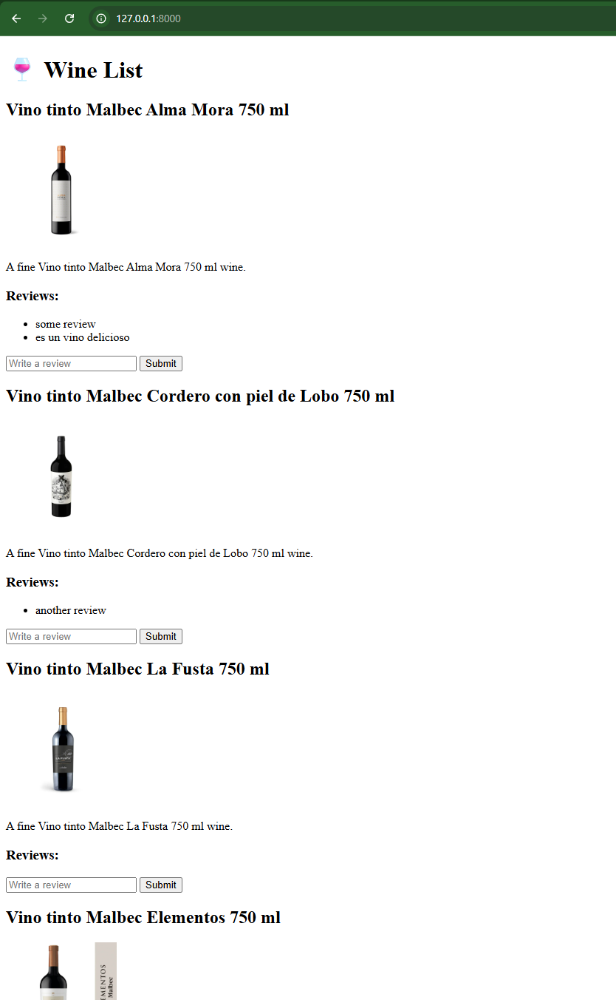

# Demo - Reviews de vinos
Demo de una app para hacer reviews de vinos

## Requerimientos
Python3, ejemplos: https://learn.microsoft.com/en-us/windows/python/web-frameworks

## Instalacion

### Crear base postgres
```
sudo apt install postgresql postgresql-contrib
python migrations/init_db.py
```

### Lanzar app

```
pip install -r requirements.txt
uvicorn app.main:app --reload
```

# Screenshots

Version 1:

